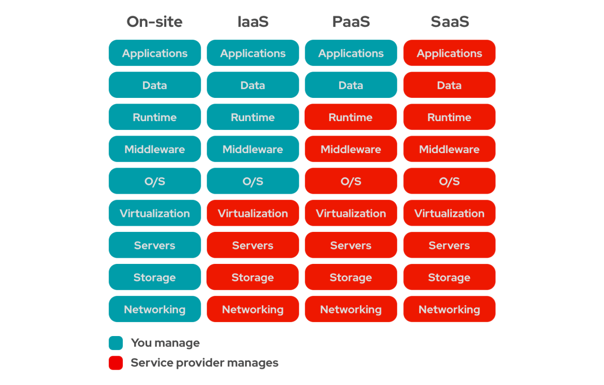

# Cloud
 

-----------------------

### 인프라란?

    
🤔 내용 보기 

 

-----------------------

인프라는 IT 서비스의 기반이 되는 기술 구성 요소들의 집합이라고 할 수 있다. 
서비스를 이루기 위해서 필요한 인프라 기술들은 아래와 같다. 

1. 하드웨어

    하드웨어는 물리적인 요소를 말한다. 
    서버, 스토리지, 전원장치들을 말한다. 
    서버를 조금 더 뜯어보면, CPU, Memory Slot, FAN, Powerm Pci Slot, Back plan등이 있다.(관련해서는 추후에 작성하도록 하겠다.)

2. 운영체제
    
    하드웨어와 네트워크 기기를 제어하기 위한 기본 소프트웨어를 말한다. 대표적으로는 내가 사랑하는 Linux가 있다. 

3. 미들웨어

    미들웨어는 서버가 특정 역할을 수행할 수 있도록 동작하는 소프트웨어를 말한다. 

    이렇게 말하니 무슨말인가 싶다. 쉽게 말해서, 미들웨어는 시스템 내의 다양한 부품(S/F 컴포넌트, 모듈 또는 서비스)들이 서로 맞물려 동작할 수 있도록 도와주는 중간 매개체이며, 이를 통해 시스템은 효율적으로 정보를 교환하고 작업을 처리한다. 

4. 네트워크

    네트워크는 호스트, 라우터, 스위치 등의 장비들이 연결되어 정보를 주고받을 수 있는 구조이며, 이는 인터넷을 포함한 다양한 서비스와 정보를 제공하거나 공유하기 위한 핵심기술 이다. 
    

-----------------------

 

### 클라우드란?

🤔 내용 보기 

 

-----------------------

클라우드란 클라우드 컴퓨팅의 줄인 말인다. 

가트너 보고서에는 클라우드를 다음과 같이 정의한다. 
> 확장 가능하고 탄력적인 IT 기능이 인터넷을 사용하는 외부의 고객들에게 서비스 형태로 제공되는 컴퓨팅 방식

인터넷 기반 컴퓨팅으로 데이터를 자신의 컴퓨터가 아닌 인터넷에 연결된 다른 컴퓨터로 처리하는 기술을 말한다. 즉,인터넷만 연결되어 있다면 연결가능한 서버 또는 네트워크이다. 

-----------------------

 

### 클라우드 컴퓨팅의 형태?

🤔 내용 보기 

 

-----------------------

클라우드에는 크게 3가지의 종류가 있다. 

    </img>

1. IaaS

    IaaS는 Infrastructure as a Service로 인프라 요소를 가상환경으로 만들어 필요에 따라 자원을 제공하는 형태를 말한다. 

    자원으로 가상머신, 스토리지, 네트워크 등이 있다. 

    OS부터 상위의 모든 플랫폼이나 애플리케이션을 사용자가 직접 구성을 해야한다. 

    대표적으로 AWS의 EC2와 OpenStack이 있다. 

2. PaaS

    PaaS는 Platform as a Service로 일반적으로 애플리케이션 빌드, 테스트, 배포하늗네 필요한 구성들을 제공하는 형태를 말한다. 

    이러한 구성 환경을 제공함으로 개발자들은 개발에 집중할 수 있게 되었다. 

    대표적으로는 Azure의 App Service가 있다. 

3. SaaS

    SaaS는 Software as a Service로 소프트웨어 및 관련 데이터는 중앙에 호스팅 된다. 
    또한 사용자는 웹 브라우저 등의 클라이언트를 통해 접속하는 형태의 소프트웨어 전달 모델이다. 

    이러한 SaaS는 소프트웨어 업그레이드, 유지보수 및 보안 업데이트같은 작업을 제공자가 처리하므로 사용자는 이런 부분을 전혀 신경 쓰지 않아도 된다. 

    대표적으로는 구글 workspace, MS365가 있다. 

-----------------------

 

### 클라우드 컴퓨팅의 특징

🤔 내용 보기 

 

클라우드 컴퓨팅의 특징은 아래와 같다.

1. On-Demand Self-Service
    
    사용자가 서비스 관리자의 개입 없이 원하는 시점에 서비스를 바로 사용할 수 있어야 한다는 특징.

2. Broad Network Access

    네트워크를 통해 제공받고, 표준 매커니즘을 이용해 액세스하는 특징.

    즉, 플랫폼 관계 없이 네트워크를 통해 사용한다는 것이 중요한 특징을 갖는다.

3. Resource Pooling

    물리적인 자원이나 가상화된 자원은 풀로 관리되는데, 
    이는 사용자의 요청에의해 사용자에게 할당되거나 다시 풀로 반환되어 한다. 

    Resource Pooling은 물리적 위치, 크기 등에 대해 모르고 자원을 추상화시켜 제공하는 특징.

4. Repid Elasticity

    자동으로 외부 수요와 상응하여 신속하게 확장 가능한 특징.

    사용자는 자원을 무한대로 확장할 수 있거나 필요한 만큼의 수준으로 마음대로 줄일수 있어야 한다. 
    또한 이러한 작업은 수분 이내로 이루어져야 한다. 

5. Measured Service

    자원의 사용량이 실시간으로 수집되고 모니터링이 되어야 하는 특징.

-----------------------

-----------------------

 

### 클라우드 사용 이유

🤔 내용 보기 

 

전통적으로 온프레미스 환경으로 시스템을 구축했다. 

그런데 클라우드가 나오면서 현재 대부분의 기업들은 클라우드 환경으로 많이 넘어가고 있다. 

그러면 왜 기업들은 클라우드를 선택을 하고 클라우드를 사용하는걸까?

이는 클라우드의 장점과도 밀접한 관계가 있다. 

클라우드의 중요한 장점으로 확장성과 안전성을 말할 수 있다. 

확장성이란 리소스의 빠른 할당으로 인하여 컴퓨팅의 리소스를 필요에 따라 빠르게 확장/축속할 수 있다. 
이를 통하여 많은 트래픽이 들어와서 시스템에 더 많은 노드를 추가해야 하는 상황이어도 빠르게 노드를 추가하여 워크로드를 효과적으로 분산시킬 수 있다. 이를 Scale Out이라고 한다. 
또한 단일 노드의 리소스, CPU, Memory, Storage 등 용량을 빠르게 늘릴 수 있다. 

그리고 안정성, 즉 시스템의 다운타임을 최소화하여 서비스가 정상적으로 유지 될 수 있도록 한다. 클라우드의 데이터센터는 전 세계에 퍼져있는데, 자연재해나 어떠한 문제로 문제가 발생 시에 다른 곳의 데이터센터에서 백업을 구축하여 서비스에 문제가 없도록 한다. 

클라우드의 이러한 장점으로 트래픽 변화가 많은 시스템이나 빠른 서비스가 되어야 하는 시스템들에서 사용하기에 좋다보니 많은 기업들은 클라우드를 구축하여 사용하고 있다. 

그렇다고 온프레미스는 필요없느냐? 절대 아니다!! 

온프레미스와 클라우드는 같은 목표, 가용성 보장을 목표로 한다는 것은 같지만 개념에서 차이가 있다. 

온프레미스는 서버가 죽지 않도록 하는 것이 목표이다. 

반면 클라우드는 많은 인스턴스로 이루어진 분산 환경에서 인스턴스가 죽으면 다른 인스턴스가 빠르게 대체하는 것을 목표로 한다. 

결국 잠시라도 서비스가 끊겨서는 안되는 시스템이나 CSP에서 보장하는 가용성 이상의 가용성이 필요한 시스템은 온프레미스가 유리하다. 

또한 높은 기밀성이 요구되는 데이터를 다루는 시스템이나 공장이나 산업 시스템 같이 일반적이지 않은 환경에서는 온프레미스가 더욱 유리하다.  

그리고 너무 많은 클라우드의 사용은 CSP에 지불해야 하는 비용이 높아지게 되는데, 비용이 온프레미스 구축 및 유지보수보다 더 나오게 되는 경우도 있다. 

그래서 하이브리드 클라우드 형태로 많이들 사용한다. 즉, 온프레미스와 클라우드를 함께 사용한다. 

-----------------------

-----------------------

 

### 클라우드 네이티브

🤔 내용 보기 

 

클라우드 네이티브라 클라우드의 장점을 최대한 활용한 정보 시스템을 구축 및 실행하는 환경을 의미한다.

기술, 애플리케이션, 아키텍처, 개발방법론, 조직 등의 다양한 용어와 결합하여 다양한 의미로 사용하는 것으로 국가 표준 프레임워크 포털에서 정의하고 있다. 
이러한 클라우드 네이티브에는 MSA(Microservices Architecture), 컨테이너, CI/CD, DevOps들이 존재한다. 

[MSA]

    MAS는 Microservices Architecture 소프트웨어를 여러 작은 독립적인 서비스로(컴포넌트) 분해하여 개발하고 운영하는 아키텍처 패턴을 의미한다. 
    각 컴포넌트들은 프로세스로 실행하고 각 서비스가 REST Api나 메시징을 이용하여 통신한다. 

    전통적인 개발 방식으로 하나의 프로젝트에 모든 기능을 함꼐 포함하여 배포하는 방식인 모놀리식 아키텍처가 있다. 
    모놀리식 아키텍처는 빠르게 개발이 가능하며 필요한 모든 기능을 한번만 호출하기 때문에 복잡한 통신 없이 사용할 수 있다. 
    예시로 하나의 웹 개발을 개발하기 위해 모듈별로 개발하고 완료된 애플리케이션을 하나의 결과물로 패키징하여 배포되는 형태를 말한다. 
    하지만 코드가 많아지면 많아질수록 유지관리 및 확장이 어려워지고 일부 기능을 수정하거나 업데이트하려면 애플리케이션 전체를 다시 배포해야만 한다. 

    이러한 단점을 보완하기 위해 클라우드 환경에서 서버를 구축하는 MSA를 사용한다. 

    MSA를 통하여 각각의 서비스는 모듈화가 되어 모듈끼리 통신을 한다. 이로인하여 각각 개별의 서비스 개발을 빠르게 하며 유지보수도 쉽게 가능하다. 
    이뿐만이 아니라 팀 단위로 기술 스택을 다르게 가져가도 모듈 연동에 있어 무리가 없다. 
    여기서 끝이냐? 더 있다. 
    서비스가 개별적이기에 독립적으로 배포가 되고 이는 지속적인 배포(CD)가 쉬워졌으며 각 서비스 부하에 따라 개별적으로 Scale-Out이 가능하다. 

    하지만 모놀리식에 비해 많이 복잡하다. 서비스가 모두 분산되어 있다보니 내부 시스템의 통신을 어떻게 가져갈기 정해야하고 통신 장애나 서버 부하 등이 발생한 경우 트랜잭션 유지 방법을 결정하고 구현해야한다. 

[컨테이너] 

    </img>

    마이크로 서비스 애플리케이션으로 개발된 결과를 컨테이너 기반의 가상화에 의해 실행되는 경우가 많다. 
    컨테이너 가상화는 기본의 물리적인 서버를 운영하는 것처럼 사용되는 서버 가상화에 비해서 적은 리소스를 사용하고, 공유할 수 있는 부분에 대해서 각각의 컨테이너 가상화 인스턴스들이 레이어로 구분되어 있는 상태에서 공유를 해주어 리소스를 통해서 애플리케이션이라던가 미들웨어, 운영체제 등을 기동할 수 있다. 

[CI/CD]

    CI는 Continous Integration으로 주기적으로 빈번하게 작은 단위로 배포를 하곘다는 의미를 가진다. 
    또한 통합을 위한 단계로 빌드, 테스트, merge 부분을 자동화 한다. 
    이로인하여 개발의 생산성 향상과 문제점을 빠르게 발견하여 수정할 수 있게 되었다. 

    CI는 크게 3가지의 역할을 수행한다.
    1. 코드관리
    2. 통합
    3. 배포

    CD는 두 가지가 있다.
    1. Continuous Delivery
    CI에서 통합된 데이터를 검증하고 최종 배포를 수동으로 하는 작업을 말한다. 

    2. Continous Deployment
    CI에서 통합된 데이터를 검등하고 최종 배포를 자동으로 하는 작업을 말한다. 

[DevOps]

    DevOps란 Development + Operation이다. 
    한마디로 엔지니어가 프로그램이하고 빌드하고 직접 시스템에 배포 및 서비스를 운영하는 것을 말한다. 

    또한 사용자와 끊임 없이 커뮤니케이션을 하고 서비스를 개선해 나가는 조직의 문화를 말하기도 한다. 

-----------------------

-----------------------

 

### 3 Tier Architecture

🤔 내용 보기 

 

N Tier Archotecture는 미들웨어를 구성할 때 많이 고민하는 요소 중 하나이다. 

- 1 Tier Architecture

    한 개의 시스템 내에 서버와 클라이언트 프로그램이 공존하는 논리적인 클라이언트-서버 시스템 구성 방법이다. 

    쉽게 말해서 web+was+db가 하나의 서버 내에 설치되는 것을 말한다. 

    1티어는 시스템 구축에 많은 요소 기술이 필요하지 않고 관리와 보안이 쉽다. 

    하지만 서버가 비대해지고 사용자 수가 많아짐에 따라 서버 부하가 기하급수적으로 증가한다. 

- 2 Tier Architecture

    클라이언트와 서버가 물리적으로 서로 독립된 시스템에 존재하는 형태로 구성된다. 

    2대의 서버로 구성되고, 한대에 web+was를 다른 한대에는 db를 구축한다. 

    2계층, 클라이언트-서버 방싯ㄱ으로 발전하여 1티어보다는 부하가 상당 부분 들어들었다.

    또한 더욱 정교한 자료 분석과 사용자로의 정보 제공이 가능하다. 

- 3 Tier Architecture

    3 Tier Architecture는 다중 계층 구조에서 널리 사용되며, presentation, application, data 3개의 계층으로 구성된다. 

    WEB 서버 / WAS 서버 / DB 서버로 구성이 된다. 

    이를 통하여 한쪽으로 기능이 비대해지는 현상을 방지하고 서버의 확장성이 다른 아키텍처보다 용이하여 사용자 수가 급증하더라도 일정한 시간에 응답을 얻을 수 있다. 

    하지만 적정 수의 사용자가 사용하지 않으면 2티어보다 성능이 떨어질 수 있고, 관리 포인트가 늘어남에 따라 장애 발생 포인트가 늘어났다. 

-----------------------

