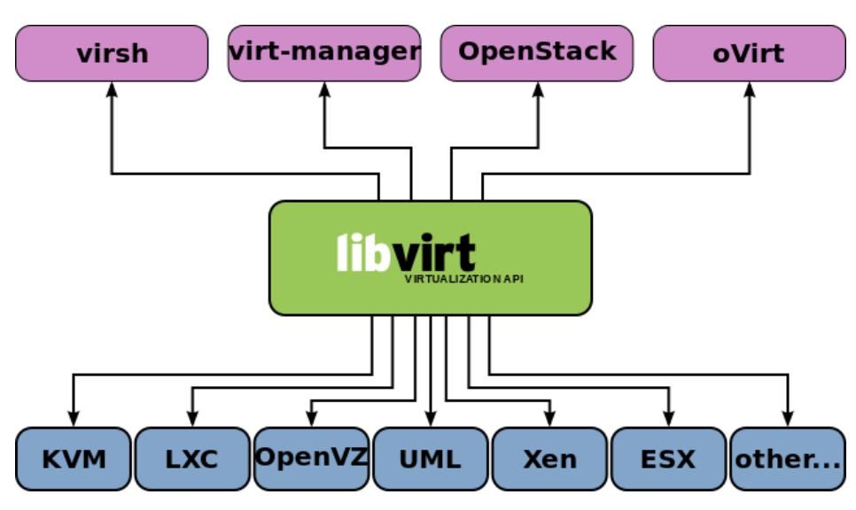
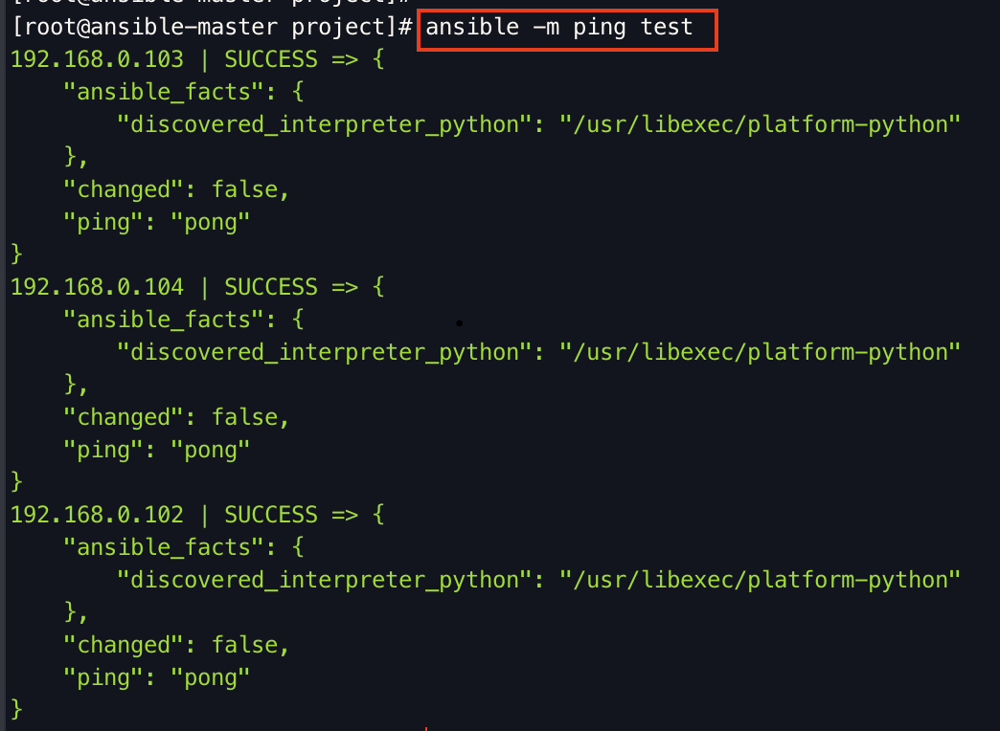

# VirtualMachine
<br>

-----------------------

### 가상머신(VM)

<details>
    <summary>🤔 내용 보기 </summary>
<br/>

-----------------------

<div align="center">
    </img>
</div>

VM, Virtual Machine은 물리적 하드웨어 시스템, 즉 온프레미스에 구축되어 자체 CPU, 메모리, 네트워크 인터페이스 및 스토리지를 갖추고 컴퓨터 시스템으로 작동하는 가상환경이다. 

VM은 하이퍼바이저라 불리는 소프트웨어로 가상머신 생성하고 구동한다. 
하이퍼바이저는 가상머신 모니터라고도 한다. 

하이퍼바이저는 CPU, 메모리, 스토리지 같은 리소스를 기존 게스트 간에 또는 새 가상 머신에 손쉽게 재할당할 수 있게 한다. 

즉, 이러한 하이퍼바이저를 통하여 하드웨어에서 가상 머신의 리소스를 분리하고 적절히 프로비저닝하여 VM에서 사용할 수 있도록 한다.

예를 들어, 용도가 다른 3개의 물리 서버가 있다. 
하나는 메일서버, 하나는 웹서버, 하나는 내부 레거시 애플리케이션 실행 용도의 서버이다. 
각 서버는 잠재적인 실행 용량의 일부에 불과한 30% 용량만 사용하고 있다. 

전통적으로는 1개의 서버와 운영체제, 1개의 태스크와 같이 개별 서버에서 개별 태스크를 실행해야 한다. 
하지만 이는, 1개의 서버로 여러 개의 태스크를 처리해야한다는 위험성이 존재한다. 

하지만 가상화를 통하여 3대 중 하나의 서버에 고유한 서버로 분할해 독립적인 태스크를 처리하도록 하고 레거시 애플리케이션을 마이그레이션을 할 수 있다. 
이를 통하여 하드웨어를 효율적으로 사용할 수 있다. **이것이 VM을 사용하는 가장 큰 이유가 된다.**

이러한 하이퍼바이저 중 리눅스 기능 중 하나인 KVM이 있다. 
</details>

-----------------------

<br>

### 가상화 유형

<details>
    <summary>🤔 내용 보기 </summary>
<br/>

-----------------------

- 데이터 가상화

    <div align="center">
        </img>
    </div>

    데이터 가상화란, 여러 곳에 분산되어 있는 데이터를 단일 소스로 통합하는 것을 의미한다.

    데이터 가상화를 통해 기업은 데이터를 동적 공급 요소로 다루어 여러 소스에서 데이터를 동시에 가져오고 새로운 데이터 소스를 손쉽게 통합하며 사용자의 요구에 따라 데이터를 변환할 수 있는 처리 역량을 확보할 수 있다. 

    즉, 데이터 가상화는 여러 데이터 소스를 단일 소스로 처리되게 하고, 이를 통하여 필요한 데이터를 필요한 형식으로 적시에 애플리케이션 또는 사용자에게 제공한다. 


- 데스크탑 가상화

    <div align="center">
        </img>
    </div>

    사용자의 데스크탑 환경을 가상 머신으로 만들어 여러 사용자가 동시에 사용할 수 있도록 하는 기술이다. 
    이를 통하여 중앙 집중식으로 데스크탑 환경을 관리하며 사용자는 어디서든 접든하여 작업할 수 있다. 
    또한 보안 강화와 업그레이드/유지보수 용이성 등의 장점도 얻을 수 있다.

- 서버 가상화

    <div align="center">
        </img>
    </div>

    하나의 물리적은 서버를 여러 개의 가상 서버로 분할하여 독립적으로 실행하는 기술이다. 

    대표적으로 VMware의 vSphere가 있다. 

    서버 가상화를 통하여 하나의 물리적 서버에서 여러 가상 서버를 운영함으로 서버 자원을 효율적으로 활용하고 서버의 가용성과 확장성을 높일 수 있다. 

- 운영체제 가상화

    <div align="center">
        </img>
    </div>

    하나의 물리적인 컴퓨터에서 여러 개의 독립적인 가상 운영체제 환경을 만들어 실행하는 기술이다. 
    이를 통해 하드웨어 리소스를 효율적으로 활용하고 여러 개의 운영체제를 별도로 설치하고 관리할 필요 없이 여러 사용자 또는 서비스가 독립적으로 실행될 수 있다. 

    대표적으로 VMware vSphere와 KVM 그리고 Docker가 있다. 

    **VMware vSphere : 물리적인 서버를 가상화하여 여러 가상머신을 실행할 수 있다.**

    **KVM : 리눅스 운영체제에서 사용되는 오픈소스 가상화 플랫폼으로 하드웨어 가상화를 지원한다.** 

    **Docker : 운영체제 수준의 컨테이너 가상화 기술로 응용 프로그램과 의존성을 포함하는 컨테이너를 만들고 실행할 수 있다.**

- 네트워크 기능 가상화

    물리적인 네트워크 하드웨어에서는 논리적인 네트워크를 분리하여 가상 네트워크를 생성한다. 

    이를 통하여 가상 네트워크를 생성하고 관리함으로 네트워크의 유연성과 안정성을 향상시킬 수 있다.
    또 네트워크 구성 관리가 용이하고 보안을 강화할 수 있다. 

    대표적으로 VMware NSX이 있다. 

- 애플리케이션 가상화

    응용프로그램을 가상 컨테이너 안에 포장하여 호스트 운영체제와 분리된 환경에서 실행하는 기술이다. 

    애플리케이션 가상화를 통하여 응용 프로그램의 배포 및 관리가 용이해지고, 호스트 운영체제와의 충돌을 최소화할 수 있다. 
    또 애플리케이션 이식성과 보안성을 향상시킬 수 있다. 

    대표적으로 Docker가 있다. 

</details>

-----------------------

<br>

### KVM

<details>
    <summary>🤔 내용 보기 </summary>
<br/>

-----------------------

1. KVM이란?? 
    
    KVM이란 리눅스의 커널 기반 가상머신을 만들어주는 하이퍼바이저이다. 
    KVM을 사용하면 호스트 머신에서 VM같이 격리된 가상 환경 여러개를 실행할 수 있다. 

2. KVM 작동원리

    KVM을 사용하면 1유형인 베어메탈 하이퍼바이저로 변환이 된다.

    하이퍼바이저는 VM을 실행하려면 운영체제 수준의 구성 요소가 필요하다.

    a. 메모리 관리 프로그램
    
    b. 프로세스 스케줄러

    c. I/O 스택

    d. 기기 드라이버

    e. 보안 관리 프로그램

    f. 네트워크 스택

    KVM은 리눅스 커널의 일부이기에 이러한 구성 요소를 모두 가지고 있다. 
    
    모든 VM은 표준 리눅스 스케줄러를 통해 일정이 예약되면 네트워크 카드, 그래픽 어댑터, 프로세서, 메모리, 디스크와 같은 전용 가상 하드웨어를 사용해 일반적인 리눅스 프로세스로 구현이 된다. 

3. libvirt란?

    가상화 소프트웨어에는 Quem-KVM, Xen, VMware 등이 있다. 이들을 이용해 VM을 생성하고 운용하고 삭제할 수 있다. 
    이 때 각자의 소프트웨어에 맞는 API, CLI등을 사용해야 한다. 

    따라서 여러 가상화 소프트웨어를 사용한다면 큰 불편함이 생기게된다. 

    이러한 불편함을 해결해주기 만들어진 것이 libvirt이다. 

    libvirt는 Quem-KVM, Xen, VMware 등이 다양한 하이퍼바이저를 작동시키기 위한 통합 API이다.
    libvirt 하나만으로 여러 하이퍼바이저 및 그들에 의해 생성된 여러 vm을 조작할 수 있다. 

    libvirt만으로 Quem-KVM이나 Vmaware 등 여러 가상화 소프트웨어를 조작할 수 있게 되었다. 

    <div align="center">
        </img>
    </div>

    사진을 보면 libvirt를 사용함으로 파란박스에 있는 여러 가상화 소프트웨어를 다룰 수 있다. 

    또 libvirt API를 사용하여 빨간박스 안에 있는 vm관리 애플리케이션들을 통하여 vm들을 관리할 수 있다. 

4. KVM 구축하기

    나는 RHEL8 버전을 통하여서 진행을 했는데, Cent나 Rocky에서도 아마 동일하게 동작을 할 것이다. 우분투는 아래와 같은 순서로 진행을 하면 된다. 

    그리고 먼저 호스트가 가상화 지원을 하는지 먼저 확인을 해야한다. 

    나는 리눅스 서버가 지원을 하는지 확인을 하였고 방법은 아래의 명령어로 확인하면 된다. 
    ```
    lscpu | grep Virtualization
    ```

    a. 패키지 설치
    ```
    yum install qemu-kvm libvirt virt-install bridge-utils virt-manager 
    ```

    b. vm 관리 패키지 설치
    ```
    dnf install -y libvirt-devel virt-top libguestfs-tools virt-manager virt-install
    ```

    c. libvirtd 활성화 및 시작
    ```
    systemctl enable --now libvirtd
    systemctl status libvirtd
    ```

    d. 시스템 체크
    ```
    virt-host-validate
    ```

    e. X11 패키지 설치
    ```
    dnf install xterm xorg-x11-xauth xorg-x11-fonts-* xorg-x11-utils -y
    ```


    f. 실행

</details>

-----------------------

<br>

### Vagrant

<details>
    <summary>🤔 내용 보기 </summary>
<br/>

-----------------------

1. Vagrant란?

    <div align="center">
        </img>
    </div>

    Vagrant란 여러 대의 가상 환경을 구축하고 관리할 수 있도록 도와주는 프로비저닝 도구이다. 
    
    그래서 개발자들이 동일한 개발환경을 구축하고 다른 운영체제나 호스트에서 동일한 개발 환경을 실행할 수 있게 해준다. 

    Vagrant는 IaC이다. 추가적으로 아주 정밀하지는 않지만 자동화도 지원한다. 

    ruby로 개발이 되었으며, 환경 구축을 위해 Vagrantfile을 작성하여 구축을 위한 설정을 한다. 이 파일은 git 같이 버전관리 시스템에 저장하여 다른 사람들과 공유할 수 있다. 

    이러한 Vagrant는 VirtualBox, VMware 그리고 지금 내가 함께 사용하고 있는 KVM과 함께 사용이 가능하다. 

2. Vagrantfile

    [Vagrantfile 보기](./image/Vagrantfile)
    
    vagrantfile의 각 구성요소는 다음과 같다.

    |이름|설명|
    |:-----:|:-----|
    |Vagrant.configure("2")|Vagrantfile의 버전을 명시한다.또한 Vagrantfile의 맨 처음에 위치해야만 한다.|
    |do config|Vagrant 설정 정의하는 블록을 열어 config라는 변수를 통하여 vagrant 설정을 지정한다.|
    |config.vm.box="centos/8"|가상 머신 이미지를 선택한다.|
    |config.vm.box_check_update=false|Vagrant가 가상 머신에 할당된 Box 이미지를 업데이트 할 때 자동으로 확인하는 것을 비활성화 하는 설정이다.|

</details>

-----------------------

<br>

### KVM과 Vagrant를 통한 VM 구축

<details>
    <summary>🤔 내용 보기 </summary>
<br/>

-----------------------

지금까지 VM은 무엇인지와 VM에 속하는 KVM 그리고 Vagrant에 대해서 알아보았다. 

이론적으로 알고만 있으면 잘 이해가 안간다.

직접 손으로 쳐보는게 제일 빠르게 이해하고 습득할 수 있다. 

그래서 지금 아주 간단하게 Vagrant를 통하여 ansible vm을 생성하고 간단하게 ansible을 통하여 다른 vm으로 ping테스트를 해보도록 하겠다. 

1. vagrant 커스텀 box 이미지 생성

    나의 경우에는 환경이 qemu-kvm 환경이라서 vmware나 virtualbox보다는 조금 복잡할 수 있다. (삽질 좀 했다.)

    1. qcow2 파일 만들기
    ```
        qemu-img create -f qcow2 /data/vm_disk/ansible-master-centos.qcow2 20G
    ```

    2. 만들어진 qcow2 파일로 vm 생성
    ```
        virt-install --name ansible-master \
         --ram 4096  \
         --vcpus 2 \
         --disk /data/vm_disk/ansible-master-centos.qcow2,format=qcow2 \
         --network bridge=br0  \ 
         --graphics vnc,listen=0.0.0.0 \
         --noautoconsole  \
         --os-type=linux \
         --os-variant=centos8  \
         --location=/data/images/CentOS-8.4.2105-x86_64-dvd1.iso
    ```

    3. vm 접속하여 설정
    ```
    # repository 변경
    sed -i 's/mirrorlist/#mirrorlist/g' /etc/yum.repos.d/CentOS-Linux-*
    sed -i 's|#baseurl=http://mirror.centos.org|baseurl=http://vault.centos.org|g' /etc/yum.repos.d/CentOS-Linux-*

    # vagrant 계정 생성 및 비밀번호 설정
    sudo useradd vagrant
    echo 'vagrant:vagrant' | sudo chpasswd

    # should be able to run sudo commands without a password prompt
    sudo touch /etc/sudoers.d/vagrant
    echo 'vagrant ALL=(ALL) NOPASSWD:ALL' | sudo tee /etc/sudoers.d/vagrant > /dev/null

    # get the master key
    sudo mkdir -p /home/vagrant/.ssh
    sudo yum install wget vim -y
    sudo wget --no-check-certificate https://raw.github.com/mitchellh/vagrant/master/keys/vagrant.pub -O /home/vagrant/.ssh/authorized_keys
    sudo chmod 0600 /home/vagrant/.ssh/authorized_keys
    sudo chown -R vagrant:vagrant /home/vagrant/.ssh

    # ssh 설정 변경
    sudo sed -i 's/#PermitEmptyPasswords no/PermitEmptyPasswords yes/' /etc/ssh/sshd_config
    sudo sed -i 's/#PasswordAuthentication yes/PasswordAuthentication yes/' /etc/ssh/sshd_config
    sudo sed -i 's/#PubKeyAuthentication yes/PubKeyAuthentication yes/' /etc/ssh/sshd_config
    sudo sed -i 's/#AuthorizedKeysFile/AuthorizedKeysFile .ssh\/authorized_keys/' /etc/ssh/sshd_config
    sudo systemctl restart sshd
    ```    

    4. 이후 해당 vm은 삭제를 한다.
    ```    
    virsh undefined [ vm name ]
    ```    

    5. box를 만들기 위한 디렉토리 생성 이후 metadata.json 파일 생성
    ```    
    vim metadata.json

    {
    "provider"     : "libvirt",
    "format"       : "qcow2",
    "virtual_size" : 25
    }
    ```    

    6. vagrant init을 통하여 vagrantfile 생성 및 작성
    ```    
    # -*- mode: ruby -*-
    # vi: set ft=ruby :

    Vagrant.configure("2") do |config|
    config.vm.provider :libvirt do |libvirt|
        libvirt.driver = "kvm"
        libvirt.uri = 'qemu:///system'
        libvirt.host = 'localhost'
        libvirt.qemu_use_session = false
        libvirt.nested = true
    end
    end
    ```    

    7. qcow2 파일 복사 및 .img 확장자로 변경
    ```    
    cp /data/vm_disk/ansible-master-centos.qcow2 .
    mv ansible-master-centos.qcow2 box.img
    ```    

    8. 아카이브 생성
    ```    
    tar cvzf ansible_box.box ./metadata.json ./Vagrantfile ./box.img
    ```    

    9. vagrant box에 추가
    ```    
    vagrant box add --name my-ansible ansible_box.box
    ```    

2. Vagrant 파일 작성

    이후 프로젝트 디렉토리를 생성하고 이동 한다.
    그리고 "vagrant init"을 통하여 vagrant를 시작한다. 
    ```    
    # -*- mode: ruby -*-
    # vi: set ft=ruby :

    Vagrant.configure("2") do |config| 
    # vagrant provider 설정
    config.vagrant.plugins = "vagrant-libvirt"
    config.ssh.insert_key = false
    config.vm.synced_folder ".", "/vagrant", disabled: true

    config.vm.define "ansible-master" do |cfg0|
        # setting vm
        cfg0.vm.box = "my-ansible"
        cfg0.vm.box_url = "/project/my_box/ansible_box/ansible_box.box"
        cfg0.vm.host_name = "ansible-master"
        cfg0.vm.box_check_update = false
        
        # setting vm spec
        cfg0.vm.provider :libvirt do |spec|
            spec.memory = 4096
            spec.cpus = 2
        end

        # 브릿지 네트워크 설정
        cfg0.vm.network "public_network", :dev => "br1", :type => "bridge"
        cfg0.vm.network "forwarded_port", guest: 22, host: 20010, id: "ssh"
        
        # setting epel repo  
        cfg0.vm.provision "shell", inline: "sudo yum install -y epel-release elrepo-release"

        # install pyton

        # disable fireward and selinux
        cfg0.vm.provision "shell", inline: "sudo systemctl disable --now firewalld"
        cfg0.vm.provision "shell", inline: "sudo sed -i 's/^SELINUX=enforcing.*$/SELINUX=disabled/' /etc/selinux/config"
        

        cfg0.vm.provision "shell", inline: "sudo reboot"
    end
    end

    ```    

3. Vagrant 실행

    ```
    vagrant up
    ```

4. vm 접속

    ```
    vagrant ssh
    ```

5. ansible 버전 확인

    ```
    ansible --version
    ```

6. 다른 vm 서버로 ping 테스트
    <div align="left">
        </img>
    </div>
    

</details>