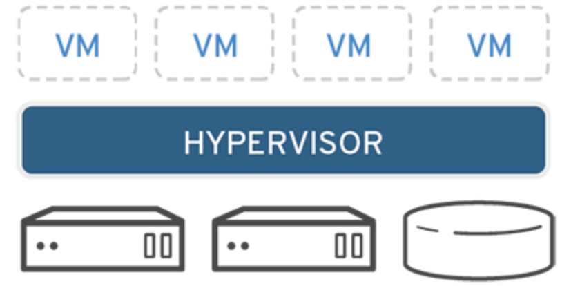

# VirtualMachine
 

-----------------------

### 가상머신(VM)

    
🤔 내용 보기 

 

-----------------------

    </img>

VM, Virtual Machine은 물리적 하드웨어 시스템, 즉 온프레미스에 구축되어 자체 CPU, 메모리, 네트워크 인터페이스 및 스토리지를 갖추고 컴퓨터 시스템으로 작동하는 가상환경이다. 

VM은 하이퍼바이저라 불리는 소프트웨어로 가상머신 생성하고 구동한다. 
하이퍼바이저는 가상머신 모니터라고도 한다. 

하이퍼바이저는 CPU, 메모리, 스토리지 같은 리소스를 기존 게스트 간에 또는 새 가상 머신에 손쉽게 재할당할 수 있게 한다. 

즉, 이러한 하이퍼바이저를 통하여 하드웨어에서 가상 머신의 리소스를 분리하고 적절히 프로비저닝하여 VM에서 사용할 수 있도록 한다.

예를 들어, 용도가 다른 3개의 물리 서버가 있다. 
하나는 메일서버, 하나는 웹서버, 하나는 내부 레거시 애플리케이션 실행 용도의 서버이다. 
각 서버는 잠재적인 실행 용량의 일부에 불과한 30% 용량만 사용하고 있다. 

전통적으로는 1개의 서버와 운영체제, 1개의 태스크와 같이 개별 서버에서 개별 태스크를 실행해야 한다. 
하지만 이는, 1개의 서버로 여러 개의 태스크를 처리해야한다는 위험성이 존재한다. 

하지만 가상화를 통하여 3대 중 하나의 서버에 고유한 서버로 분할해 독립적인 태스크를 처리하도록 하고 레거시 애플리케이션을 마이그레이션을 할 수 있다. 
이를 통하여 하드웨어를 효율적으로 사용할 수 있다. **이것이 VM을 사용하는 가장 큰 이유가 된다.**

이러한 하이퍼바이저 중 리눅스 기능 중 하나인 KVM이 있다. 

-----------------------

 

### 가상화 유형

    
🤔 내용 보기 

 

-----------------------

- 데이터 가상화

    

        </img>
    

    데이터 가상화란, 여러 곳에 분산되어 있는 데이터를 단일 소스로 통합하는 것을 의미한다.

    데이터 가상화를 통해 기업은 데이터를 동적 공급 요소로 다루어 여러 소스에서 데이터를 동시에 가져오고 새로운 데이터 소스를 손쉽게 통합하며 사용자의 요구에 따라 데이터를 변환할 수 있는 처리 역량을 확보할 수 있다. 

    즉, 데이터 가상화는 여러 데이터 소스를 단일 소스로 처리되게 하고, 이를 통하여 필요한 데이터를 필요한 형식으로 적시에 애플리케이션 또는 사용자에게 제공한다. 

- 데스크탑 가상화

    

        </img>
    

    사용자의 데스크탑 환경을 가상 머신으로 만들어 여러 사용자가 동시에 사용할 수 있도록 하는 기술이다. 
    이를 통하여 중앙 집중식으로 데스크탑 환경을 관리하며 사용자는 어디서든 접든하여 작업할 수 있다. 
    또한 보안 강화와 업그레이드/유지보수 용이성 등의 장점도 얻을 수 있다.

- 서버 가상화

    

        </img>
    

    하나의 물리적은 서버를 여러 개의 가상 서버로 분할하여 독립적으로 실행하는 기술이다. 

    대표적으로 VMware의 vSphere가 있다. 

    서버 가상화를 통하여 하나의 물리적 서버에서 여러 가상 서버를 운영함으로 서버 자원을 효율적으로 활용하고 서버의 가용성과 확장성을 높일 수 있다. 

- 운영체제 가상화

    

        </img>
    

    하나의 물리적인 컴퓨터에서 여러 개의 독립적인 가상 운영체제 환경을 만들어 실행하는 기술이다. 
    이를 통해 하드웨어 리소스를 효율적으로 활용하고 여러 개의 운영체제를 별도로 설치하고 관리할 필요 없이 여러 사용자 또는 서비스가 독립적으로 실행될 수 있다. 

    대표적으로 VMware vSphere와 KVM 그리고 Docker가 있다. 

    **VMware vSphere : 물리적인 서버를 가상화하여 여러 가상머신을 실행할 수 있다.**

    **KVM : 리눅스 운영체제에서 사용되는 오픈소스 가상화 플랫폼으로 하드웨어 가상화를 지원한다.** 

    **Docker : 운영체제 수준의 컨테이너 가상화 기술로 응용 프로그램과 의존성을 포함하는 컨테이너를 만들고 실행할 수 있다.**

- 네트워크 기능 가상화

    물리적인 네트워크 하드웨어에서는 논리적인 네트워크를 분리하여 가상 네트워크를 생성한다. 

    이를 통하여 가상 네트워크를 생성하고 관리함으로 네트워크의 유연성과 안정성을 향상시킬 수 있다.
    또 네트워크 구성 관리가 용이하고 보안을 강화할 수 있다. 

    대표적으로 VMware NSX이 있다. 

- 애플리케이션 가상화

    응용프로그램을 가상 컨테이너 안에 포장하여 호스트 운영체제와 분리된 환경에서 실행하는 기술이다. 

    애플리케이션 가상화를 통하여 응용 프로그램의 배포 및 관리가 용이해지고, 호스트 운영체제와의 충돌을 최소화할 수 있다. 
    또 애플리케이션 이식성과 보안성을 향상시킬 수 있다. 

    대표적으로 Docker가 있다. 

-----------------------

 